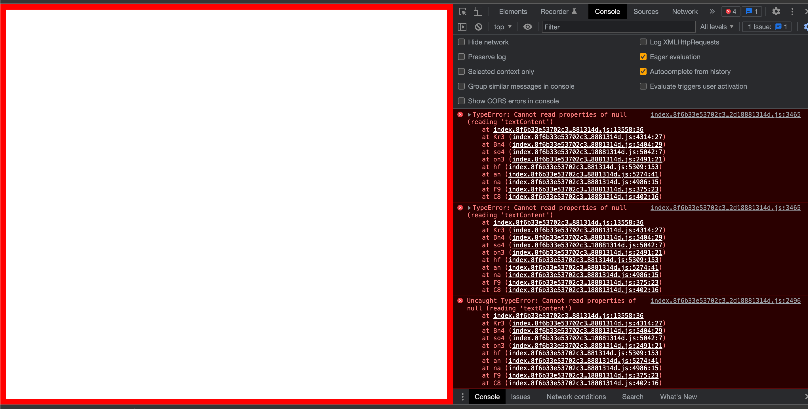

## reproduction of packup bug

### steps to reproduce

1. run the following commands
```sh
deno task build
deno task dev --app-path=./dist
```

2. Open the browser window to see the following error



### The same code works with vite

### steps

```sh
npm install
deno task vite
deno task dev --app-path=./dist
```

You should see the following

